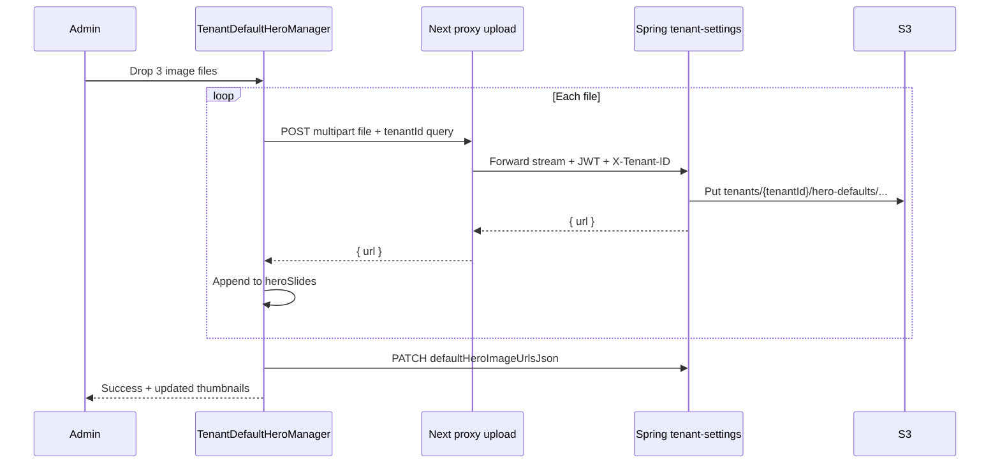

# Frontend Admin PRD: Default Homepage Hero Images (Tenant Settings)

**Related:** [DEFAULT_HERO_IMAGES_HOMEPAGE_ROTATION.html](./DEFAULT_HERO_IMAGES_HOMEPAGE_ROTATION.html) · [DEFAULT_HERO_IMAGES_BACKEND_APPLICATION_PRD.md](./DEFAULT_HERO_IMAGES_BACKEND_APPLICATION_PRD.md) · [DEFAULT_HERO_IMAGES_DATABASE_PRD.md](./DEFAULT_HERO_IMAGES_DATABASE_PRD.md) · [hero-image-selection-overlay-logic.md](./hero-image-selection-overlay-logic.md)

## Document information

| Field | Value |
|-------|--------|
| **Version** | 1.2 |
| **Status** | Phase 2c shipped; **Phase 2d (admin guidelines dialog)** specified below — frontend-only, no backend/DB changes |
| **Scope** | Admin UX in **Tenant Management → Settings** for per-`tenantId` rotating default hero images |
| **Repo** | `event-site-manager` (Next.js App Router) |

---

## 1. Executive summary

Admins need a first-class workflow to attach **multiple rotating homepage hero images** for a satellite tenant without pasting S3 URLs manually. The public homepage already consumes `defaultHeroImageUrlsJson`, `defaultHeroDisplayMode`, and `defaultHeroIncludeWithEvents` via `TenantSettingsProvider` and `resolveHeroImages()`.

**Phase 1 (shipped):** Customization tab — URL textarea, display mode, checkbox, static thumbnails.

**Phase 2 (this PRD):** Dedicated **Homepage Hero** admin experience with **drag-and-drop multi-file upload**, single-file add, reorder, remove, live preview, and optional first-time **setup walkthrough** — patterned after event **media upload-multiple** and tenant **logo / email header** upload flows.

**Phase 2c (this PRD v1.1):** **Opt-in active selection** — library of up to 20 images, up to **10** marked active, separate **homepage display count** (1–6, default **6**), and **random-3 fallback** from the library when zero slides are marked active.

**Phase 2d (this PRD v1.2):** **In-tab guidelines & assistance** — `?` help icon beside the Homepage Hero section title (same interaction pattern as `EventFormHelpTooltip` on the event form). Opens a scrollable dialog with step-by-step upload, active-selection, display, and fallback rules. **No new API fields, migrations, or backend work.**

---

## 2. Problem statement

| Pain today | Target |
|------------|--------|
| Admins must upload images elsewhere, copy HTTPS URLs, paste one per line | Upload images directly in tenant settings |
| Hero config buried under Custom CSS/JS on Customization tab | Clear **Homepage Hero** tab or guided wizard |
| No reorder except editing textarea order | Drag-and-drop slide order with numbered thumbnails |
| No progress feedback for multiple files | Per-file and batch upload progress (like event media) |
| Super-admin editing another tenant must remember `tenantId` for S3 paths | Upload uses row `tenantId` via `?tenantId=` on proxy (same as logo upload) |
| Every uploaded image always rotates on homepage | **Library** (up to 20) vs **active** subset (up to 10) vs **display cap** (default 6) |
| No way to run slideshow without picking slides | **Random 3** from library when zero slides marked active |

---

## 3. Users and entry points

| Persona | Goal | Entry |
|---------|------|--------|
| Tenant admin | Brand homepage when no event heroes | `/admin/tenant-management/settings/{id}/edit` |
| Super admin | Configure satellite tenant (`mosc-temp`, etc.) | Same; `tenantId` on settings row drives upload |
| Onboarding ops | Seed defaults for new tenant | Script + optional link to **Homepage Hero** tab after create |

**Routes (unchanged):**

- List: `/admin/tenant-management/settings`
- Edit: `/admin/tenant-management/settings/[id]/edit`
- Create: `/admin/tenant-management/settings/new`

---

## 4. UX recommendation

### 4.1 Primary: new tab **Homepage Hero** (recommended)

Add a fifth tab to `TenantSettingsForm` alongside General, Integrations, Limits, Customization.

| Tab | Color (unique in group) | Content |
|-----|-------------------------|---------|
| `homepageHero` | **Teal** (`teal-50/100/500/800`) | Full hero manager (this PRD) |

**Rationale:** Hero rotation is a distinct product surface (not “custom CSS”). A dedicated tab matches how **Integrations** isolates WhatsApp/email config. Keeps Customization tab for CSS/JS/email assets only.

**Move from Customization tab:** Remove the existing “Default Homepage Hero Images” block from Customization once the new tab ships (avoid duplicate editors).

### 4.2 Secondary: optional setup walkthrough (first visit)

When `defaultHeroImageUrlsJson` is empty and `mode === 'edit'`:

1. Show a compact **3-step callout** at top of Homepage Hero tab (not a blocking modal):
   - **Step 1 — Upload slides** (drag multiple images or pick one)
   - **Step 2 — Choose display mode** (slideshow / random / single)
   - **Step 3 — Save** (persist + “View homepage” link in new tab)

Dismiss with “Don’t show again” stored in `localStorage` key `tenantHeroWalkthroughDismissed:{settingsId}`.

**Not in scope:** Full-page wizard outside tenant settings form; keep one form + one Save for all tabs.

---

## 5. Functional requirements

### 5.1 Slide list (source of truth in UI)

- Maintain ordered list `heroSlides: { id: string; url: string; active: boolean; fileName?: string }[]` in component state.
- Initialize from `parseTenantDefaultHeroSlides(initialData)` on load (see [defaultHeroImages.ts](../../src/lib/hero/defaultHeroImages.ts)).
- On form submit (or immediate PATCH after upload — see 5.4), serialize with `serializeDefaultHeroSlides(slides)` → `defaultHeroImageUrlsJson`.
- **Legacy** plain URL arrays (`["https://..."]`) are treated as all-active until admin saves enriched JSON from this UI.

### 5.2 Multi-file upload (required)

Mirror **event media** `upload-multiple` UX:

| Behavior | Requirement |
|----------|-------------|
| File input | `<input type="file" accept="image/*" multiple />` |
| Drag-and-drop | Dashed border zone; highlight on drag-over (same classes as email header / logo in `TenantSettingsForm`) |
| Batch select | User can drop or pick **1–N** files in one action |
| Validation | Image MIME only; max **10 MB** per file (align `SponsorImageUploadArea` / logo) |
| Recommended dimensions | Help text: **2000×800** (5:2 landscape) or wider; see hero mobile containment docs |
| Max slides | **20** URLs per tenant (soft cap with inline error) |

**Upload API (backend deployed):**

```http
POST /api/tenant-settings/upload/default-hero-image
Content-Type: multipart/form-data
Authorization: Bearer <jwt>   (via proxy)
X-Tenant-ID: <tenantId>
Body: file=<binary>
```

**Frontend proxy (to add):** `src/pages/api/proxy/tenant-settings/upload/default-hero-image.ts` — copy `tenant-logo.ts` pattern (`bodyParser: false`, stream forward, `?tenantId=` query).

**Client helper (to add):** `uploadDefaultHeroImageClient(file, tenantIdForUpload)` in `src/app/admin/tenant-management/settings/ApiServerActions.ts` — same shape as `uploadTenantLogoClient`.

**Batch strategy (Phase 2a):** Sequential POST per file in UI loop (no backend `upload-multiple` required). Show aggregate progress: `Uploading 2 of 5…`.

**Batch strategy (Phase 2b — optional later):** If backend adds `upload-default-hero-images-multiple`, switch to single FormData with `files[]` like `event-medias/upload-multiple`.

### 5.3 Single-file upload (required)

- Same drop zone and file input support **one** file (subset of multi).
- After success, **append** URL to end of `heroSlides` with **`active: false`** (opt-in; not auto-selected for slideshow).

### 5.4 Persist timing

| Option | Recommendation |
|--------|----------------|
| A — Upload then auto-PATCH | **Preferred:** After each successful upload (or after batch completes), call `patchTenantSetting(settingsId, { defaultHeroImageUrlsJson, defaultHeroMaxDisplayCount? })` so S3 URLs survive refresh without clicking main Save |
| B — Defer to form Save | Acceptable for MVP if A adds complexity; document that user must Save |

Match **logo / email header** behavior: those PATCH immediately after upload. **Hero should do the same.**

### 5.5 Reorder and remove

| Action | UX |
|--------|-----|
| Reorder | Drag handle on each thumbnail card; update array order |
| Remove | Red trash icon per slide; confirm if &gt; 0 slides; PATCH updated JSON |
| Slide number | Badge `1`, `2`, `3` on **active** thumbnails only (order among active slides) |

**Library:** Use native HTML5 drag-and-drop or lightweight existing project pattern; avoid new heavy dependencies unless already in repo.

### 5.5a Active selection (Phase 2c — required)

| Rule | Value |
|------|--------|
| Max library size | **20** images |
| Max marked **active** | **10** at one time |
| Default on new upload | **`active: false`** (opt-in) |
| Manual URL merge | Append with **`active: false`** |

| Action | UX |
|--------|-----|
| Toggle active | Per-thumbnail **Active** control (green = in slideshow pool; dimmed + “Inactive” when off) |
| Cap enforcement | Block 11th active toggle with inline error: “Maximum 10 active slides” |
| Zero active info | Callout: “No slides marked active — homepage will show **3 random** images from your library.” |
| Counters | `Library: N/20` · `Active: N/10` · `Rotating: min(active, display count)` or `Random 3 from library` |

**Homepage resolver** (not admin-only): see §5.5b.

### 5.5b Homepage display count and random fallback (Phase 2c — required)

| Setting | Field | Range | Default |
|---------|-------|-------|---------|
| Images in homepage rotation | `defaultHeroMaxDisplayCount` | **1–6** | **6** |

**Runtime rules** (`resolveTenantDefaultHeroUrlsForDisplay` in `defaultHeroImages.ts`):

| Condition | Homepage tenant-default URLs |
|-----------|------------------------------|
| Legacy plain URL JSON | All URLs (unchanged until admin saves enriched JSON) |
| ≥1 slide `active: true` | First **N** active slides in drag order, where `N = min(activeCount, defaultHeroMaxDisplayCount, 6)` |
| 0 active, library non-empty | **3 random** URLs from full library (or fewer if library &lt; 3) |
| Empty library | Bundled emergency image |

Then apply `defaultHeroDisplayMode` (`slideshow` / `random` / `single`) on that URL set.

### 5.6 Display settings (retain)

| Field | Control |
|-------|---------|
| `defaultHeroDisplayMode` | Select: slideshow / random / single |
| `defaultHeroIncludeWithEvents` | Checkbox with helper text linking to [hero-image-selection-overlay-logic.md](./hero-image-selection-overlay-logic.md) |
| `defaultHeroMaxDisplayCount` | Select **1–6** (default **6**): “Images in homepage rotation” when slides are marked active |

### 5.7 Live preview

- **Thumbnail strip:** object-cover cards (existing 128×80 pattern), `onError` hide broken image.
- **Hero preview panel:** Use `resolveTenantDefaultHeroUrlsForPreview()` — same rules as homepage (active subset, display cap, or random-3). Label “Preview: 3 random from library” when zero active. Rotating mini-slideshow every 4s when mode = slideshow and ≥2 preview URLs. Use `object-contain` and dark `#1a0a2e` letterbox background per hero CSS rules.

### 5.8 Advanced: paste URLs (retain as collapsible)

Collapsible **“Add URLs manually”** section:

- Textarea, one HTTPS URL per line (current behavior).
- **Merge** parsed lines into `heroSlides` (dedupe by URL), not replace uploads-only list without confirmation.

### 5.9 Create mode vs edit mode

| Mode | Upload |
|------|--------|
| `edit` + `settingsId` | Full upload enabled |
| `create` | Disable upload; show info: “Save settings first, then upload hero images on edit.” Same as logo upload when `!settingsId`. |

### 5.11 Admin guidelines & assistance dialog (Phase 2d — required, frontend-only)

Admins need on-demand help without leaving Tenant Settings. Mirror the **event form** pattern: [`EventFormHelpTooltip.tsx`](../../src/components/EventFormHelpTooltip.tsx) (`FaQuestionCircle`, click to open, portal dialog, Escape / click-outside to close).

| Requirement | Detail |
|-------------|--------|
| Placement | Inline with **“Default Homepage Hero Images”** heading (`h3` row: title + help icon) |
| Trigger | Blue `FaQuestionCircle` button (`w-5 h-5`, `title` / `aria-label`: “Default hero images guidelines and assistance”) |
| Interaction | **Click** toggles dialog (primary); optional hover-open with delay is acceptable if copied from `EventFormHelpTooltip` |
| Content source | **Preferred:** `public/documentation/default_hero_images_rotation/DEFAULT_HERO_IMAGES_ADMIN_GUIDELINES.html` fetched at open (satellite apps copy the same `public/` path + component). **Fallback:** `customContent` React node with identical copy for offline/dev |
| Dialog chrome | Gradient header (teal to match Homepage Hero tab), title **“Default Hero Images — Guidelines & Assistance”**, close `X` button |
| Backend / DB | **None** — documentation and UI only; uses existing `defaultHeroImageUrlsJson`, `defaultHeroDisplayMode`, `defaultHeroIncludeWithEvents`, `defaultHeroMaxDisplayCount` |

**Dialog sections (step-by-step, in order):**

1. **What this controls** — Tenant default homepage hero when no upcoming event hero media exists; optional trailing slides when “Include with events” is on.
2. **Before you upload (create mode)** — Save tenant settings first; return to **Edit** to enable uploads (same as logo upload).
3. **Upload rules** — Drag-and-drop or browse; PNG/JPG/JPEG/WEBP/GIF; max **10 MB** per file; recommended **2000×800** (5:2 landscape); max **20** images in library; uploads auto-save enriched JSON when `settingsId` exists.
4. **Library vs active** — Library holds all uploaded slides; only **Active** slides participate in homepage selection; **new uploads default to Inactive** (opt-in).
5. **Mark slides active** — Toggle per thumbnail; max **10** active at once; drag to reorder (order matters for active subset).
6. **Homepage display count** — Select **1–6** (default **6**): max active slides shown when ≥1 slide is active (`min(active, display count)`).
7. **Zero active fallback** — If no slides are marked active but library is non-empty, homepage shows **3 random** images from the library on each resolve.
8. **Display mode** — `slideshow` (rotate all selected URLs), `random` (one per page load), `single` (first URL only) — applied **after** active/random-3 resolution.
9. **Include with events** — When checked, tenant default slides append after upcoming event hero images.
10. **Homepage fallback chain** — Event hero media → tenant defaults (rules above) → bundled `/images/hero_section/hero_images/fallback/default-hero.webp`.
11. **Legacy data** — Plain URL JSON arrays (`["https://..."]`) keep showing **all** URLs on the homepage until an admin saves from this UI (migrates to enriched `[{ url, active }]`).
12. **Manual URLs (advanced)** — HTTPS one per line; merged as **inactive**; dedupe by URL.
13. **Verify** — Save settings → open homepage in new tab; test with/without upcoming events.

**Satellite / second-repo porting checklist:**

| Asset | Path |
|-------|------|
| Help HTML (static) | `public/documentation/default_hero_images_rotation/DEFAULT_HERO_IMAGES_ADMIN_GUIDELINES.html` |
| Reusable help UI | `src/components/admin/AdminHelpDialog.tsx` (extract/generalize from `EventFormHelpTooltip`) **or** reuse `EventFormHelpTooltip` with `customContent` / `documentationUrl` props |
| Integration | `TenantDefaultHeroManager.tsx` — icon beside section title |
| PRD (this file) | Copy §5.11 + §8.4 to satellite repo docs |

**Explicit non-scope (Phase 2d):** No changes to Spring `tenant-settings` API, DB columns, upload endpoint, or `DEFAULT_HERO_IMAGES_DATABASE_PRD.md` beyond cross-reference.

### 5.10 Tenant scoping (super-admin)

Use `tenantIdForUpload` from form/watch (already in `TenantSettingsForm`):

```typescript
const tenantIdForUpload =
  watch('tenantId')?.trim() || initialData?.tenantId?.trim() || undefined;
```

Append `tenantUploadQuery(tenantIdForUpload)` on all upload fetches.

---

## 6. Non-functional requirements

| Area | Requirement |
|------|-------------|
| Accessibility | `title` + `aria-label` on upload zone, reorder, delete; keyboard focus on tab |
| Errors | `SaveStatusDialog` or inline banner per logo/header upload pattern |
| Loading | Disable drop zone while uploading; spinner on batch |
| Security | Client uploads only via `/api/proxy/...`; no direct S3 credentials in browser |
| Performance | Lazy-load preview images; debounce manual URL textarea merge |

---

## 7. Technical design

### 7.1 New / modified files

| File | Change |
|------|--------|
| `src/app/admin/tenant-management/components/TenantDefaultHeroManager.tsx` | **New** — upload zone, slide grid, reorder, preview, walkthrough callout |
| `src/app/admin/tenant-management/components/TenantSettingsForm.tsx` | Add `homepageHero` tab; mount manager; remove hero block from Customization |
| `src/app/admin/tenant-management/settings/ApiServerActions.ts` | Add `uploadDefaultHeroImageClient` |
| `src/pages/api/proxy/tenant-settings/upload/default-hero-image.ts` | **New** — proxy to backend |
| `src/lib/hero/defaultHeroImages.ts` | **Update:** `parseTenantDefaultHeroSlides`, `serializeDefaultHeroSlides`, `resolveTenantDefaultHeroUrlsForDisplay`, constants `MAX_ACTIVE_SLIDES`, `RANDOM_FALLBACK_COUNT`, etc. |
| `src/components/admin/AdminHelpDialog.tsx` | **New (Phase 2d)** — generalized help dialog (from `EventFormHelpTooltip` pattern): `title`, `documentationUrl`, optional `customContent` |
| `public/documentation/default_hero_images_rotation/DEFAULT_HERO_IMAGES_ADMIN_GUIDELINES.html` | **New (Phase 2d)** — step-by-step admin guidelines HTML (served statically; copy to satellite `public/`) |
| `TenantDefaultHeroManager.tsx` | **Update (Phase 2d)** — `?` icon + `AdminHelpDialog` beside section heading |

### 7.2 Component API sketch

```tsx
interface TenantDefaultHeroManagerProps {
  settingsId?: number;
  tenantIdForUpload?: string;
  initialSlides?: DefaultHeroSlide[];
  displayMode: 'slideshow' | 'random' | 'single';
  includeWithEvents: boolean;
  maxDisplayCount: number;
  onSlidesChange: (slides: DefaultHeroSlide[]) => void;
  onDisplayModeChange: (mode: 'slideshow' | 'random' | 'single') => void;
  onIncludeWithEventsChange: (value: boolean) => void;
  onMaxDisplayCountChange: (count: number) => void;
  disabled?: boolean;
  mode: 'create' | 'edit';
}
```

Parent `TenantSettingsForm` keeps react-hook-form registration for mode, checkbox, and `defaultHeroMaxDisplayCount`; manager calls `onSlidesChange` so submit sets enriched `defaultHeroImageUrlsJson`.

### 7.3 Upload flow (sequence)



### 7.4 Reference implementations (copy patterns)

| Pattern | Reference file |
|---------|----------------|
| Single-file tenant upload + drag-drop | `TenantSettingsForm.tsx` (logo, email header) |
| `uploadTenantLogoClient` + `patchTenantSetting` | `settings/ApiServerActions.ts` |
| Proxy stream upload | `src/pages/api/proxy/tenant-settings/upload/tenant-logo.ts` |
| Multi-file selection + FormData loop | `MediaClientPage.tsx` (`files` input, progress) |
| Multi-image overview grid | `SponsorImageUploadArea.tsx`, `DirectorImageUploadArea.tsx` |
| Parse/serialize hero URLs | `src/lib/hero/defaultHeroImages.ts` |

### 7.5 Event media vs tenant hero upload

| | Event media `upload-multiple` | Tenant default hero |
|--|------------------------------|---------------------|
| Endpoint | `/api/proxy/event-medias/upload-multiple` | `/api/proxy/tenant-settings/upload/default-hero-image` |
| Metadata | eventId, flags, titles[] | None (tenant implied by `X-Tenant-ID`) |
| Storage path | Event media bucket layout | `tenants/{tenantId}/hero-defaults/` |
| Persistence | `event_media` rows | `tenant_settings.default_hero_image_urls_json` |
| Client | `MediaClientPage` direct fetch | `uploadDefaultHeroImageClient` + PATCH settings |

---

## 8. UI specification (Homepage Hero tab)

### 8.1 Layout (top to bottom)

1. **Page title row:** “Default Homepage Hero Images” + **`?` guidelines icon** (opens assistance dialog — §5.11)
2. **Walkthrough callout** (conditional, dismissible)
3. **Info box:** Explains fallback chain — event heroes → tenant defaults → `/images/hero_section/hero_images/fallback/default-hero.webp`
4. **Upload zone** (full width, dashed border)
   - Copy: “Upload one or more images. Drag and drop or click to browse.”
   - Accepted: PNG, JPG, JPEG, WEBP, GIF
5. **Status counters** — Library N/20 · Active N/10 · Rotating / Random-3
6. **Slide grid** (responsive `grid-cols-2 md:grid-cols-4 gap-4`)
   - Thumbnail, active toggle, active-order badge, drag handle, delete button; inactive slides dimmed
7. **Display mode** + **Include with events** + **Homepage display count (1–6)** (responsive grid on md+)
8. **Live preview** panel (uses resolver preview helper)
9. **Advanced** — collapsed “Add URLs manually”

### 8.2 Styling

- Follow admin action button pattern for primary actions (green upload CTA optional).
- Icon buttons for delete: `w-10 h-10` inline SVG per icon standards (no react-icons for action buttons in new code).
- Tab styling: match existing tab nav in `TenantSettingsForm` (teal palette, unique vs blue/green/purple/orange).

### 8.4 Guidelines dialog (Phase 2d)

- **Icon:** `FaQuestionCircle`, `text-teal-600 hover:text-teal-800` (align with Homepage Hero tab accent).
- **Dialog:** `fixed` portal, `z-[9999]`, max width `min(90vw, 800px)`, max height `min(80vh, 600px)`, scrollable body.
- **Header:** Teal gradient (`from-teal-500 to-teal-600`), yellow-tinted title text (match event-form help header pattern).
- **Body:** Render fetched HTML **or** structured `<ol>` / callout boxes mirroring §5.11 sections.
- **Accessibility:** `aria-expanded` on icon; Escape closes; focus trap optional (match existing tooltip).

### 8.3 Empty state

When no slides and no uploads:

- Illustration or icon in upload zone
- “No default hero images yet. Homepage will use the platform emergency image until you upload slides or upcoming events provide hero media.”

---

## 9. Integration with homepage runtime

No changes required to `HeroSection.tsx` if `defaultHeroImageUrlsJson` is PATCHed correctly.

**Verification after admin save:**

1. Open `/` on tenant domain (or local with correct `NEXT_PUBLIC_TENANT_ID`).
2. With no upcoming `isHomePageHeroImage` events, slideshow shows uploaded URLs.
3. Toggle `defaultHeroIncludeWithEvents` — with upcoming event heroes, tenant slides append when enabled.

---

## 10. Phased delivery

| Phase | Deliverable | Depends on |
|-------|-------------|------------|
| **2a** | Proxy route + `uploadDefaultHeroImageClient` + sequential multi-upload + PATCH | Backend upload endpoint |
| **2b** | `TenantDefaultHeroManager` + Homepage Hero tab; remove Customization duplicate | 2a |
| **2c** | Active toggles, display count, random-3 fallback, enriched JSON | 2b (`defaultHeroMaxDisplayCount` optional on API until backend column ships; client defaults to 6) |
| **2d** | **Guidelines `?` dialog** + static HTML doc; no backend/DB | 2c |
| **2e** (optional) | Backend batch upload endpoint; switch client to single request | Backend |

---

## 11. Acceptance criteria

- [ ] Admin can upload **one** image; URL appears in slide list and persists after page reload.
- [ ] Admin can upload **multiple** images in one pick/drop; all URLs appended in order with progress UI.
- [ ] Admin can **reorder** slides; order matches homepage slideshow order after save.
- [ ] Admin can **remove** a slide; PATCH updates JSON; homepage reflects removal.
- [ ] Display mode and “include with events” save with tenant settings.
- [ ] Super-admin editing tenant B uploads to tenant B’s S3 prefix (`?tenantId=`).
- [ ] Create mode shows disabled upload with clear message.
- [ ] Invalid file type/size shows inline error without breaking form.
- [ ] Manual URL paste (advanced) still works for ops with pre-uploaded S3 assets.
- [ ] Customization tab no longer contains duplicate hero URL textarea.
- [ ] New uploads are **inactive** by default; admin toggles active (max **10**).
- [ ] **Homepage display count** (1–6, default 6) saves with tenant settings.
- [ ] With **zero** active slides, homepage shows **3 random** images from library.
- [ ] With active slides, homepage uses active subset capped by display count.
- [ ] Legacy plain URL JSON unchanged until admin saves enriched format.
- [ ] **`?` guidelines icon** beside section title opens assistance dialog with upload, active, display, and fallback rules (§5.11).
- [ ] Guidelines dialog closes via **X**, **Escape**, and click-outside; no backend calls when opening help.
- [ ] Static guidelines HTML loads from `public/documentation/default_hero_images_rotation/DEFAULT_HERO_IMAGES_ADMIN_GUIDELINES.html` (or equivalent `customContent` fallback).

---

## 12. Test plan

### Manual

1. Edit settings for `tenant_demo_002` → Homepage Hero → upload 3 WEBP files → reload → 3 thumbnails, all **inactive**; homepage shows **3 random** from library.
2. Mark 4 slides active (any 4) → homepage uses min(4, display count).
3. Try 11th active → validation error.
4. Set display count to 4 with 8 active → homepage rotates first 4 **active** in order.
5. Deactivate all → homepage returns to random 3.
6. Reorder slides → save → confirm enriched JSON via GET `/api/proxy/tenant-settings/{id}`.
7. Delete middle slide → homepage reflects removal.
8. Set mode **random** → refresh homepage multiple times (visual check).
9. Enable upcoming event with `isHomePageHeroImage` + **include with events** → both event and default slides in rotation.
10. Upload 11 MB file → validation error.
11. Create new settings → upload disabled until save + re-open edit.
12. Legacy tenant with plain `["url1","url2"]` → all URLs in slideshow until enriched save.
13. Click **`?`** next to “Default Homepage Hero Images” → dialog shows all §5.11 sections; scroll works on small viewport.

### Regression

- Logo and email header upload unchanged on Customization tab.
- `node scripts/seed-tenant-default-hero-images.js` still works (CLI onboarding).

---

## 13. Out of scope

- Cropping / image resizing in admin UI (document link to `documentation/IMAGE_RESIZING_GUIDE.md` in help text only).
- Replacing S3 objects in bucket when re-uploading same filename (backend concern).
- Per-slide display duration (event media has `homePageHeroDisplayDurationSeconds`; tenant defaults use global homepage interval in `HeroSection`).
- Bulk import from another tenant’s settings.

---

## 14. References

| Resource | Path |
|----------|------|
| Architecture HTML | `documentation/default_hero_images_rotation/DEFAULT_HERO_IMAGES_HOMEPAGE_ROTATION.html` |
| Backend API PRD | `documentation/default_hero_images_rotation/DEFAULT_HERO_IMAGES_BACKEND_APPLICATION_PRD.md` |
| Database PRD | `documentation/default_hero_images_rotation/DEFAULT_HERO_IMAGES_DATABASE_PRD.md` |
| Hero resolver | `src/lib/hero/defaultHeroImages.ts` |
| Current form (Phase 1) | `src/app/admin/tenant-management/components/TenantSettingsForm.tsx` |
| Seed script | `scripts/seed-tenant-default-hero-images.js` |
| Admin guidelines HTML (Phase 2d) | `public/documentation/default_hero_images_rotation/DEFAULT_HERO_IMAGES_ADMIN_GUIDELINES.html` |
| Event form help pattern | `src/components/EventFormHelpTooltip.tsx` |
| Help dialog component (Phase 2d) | `src/components/admin/AdminHelpDialog.tsx` |
