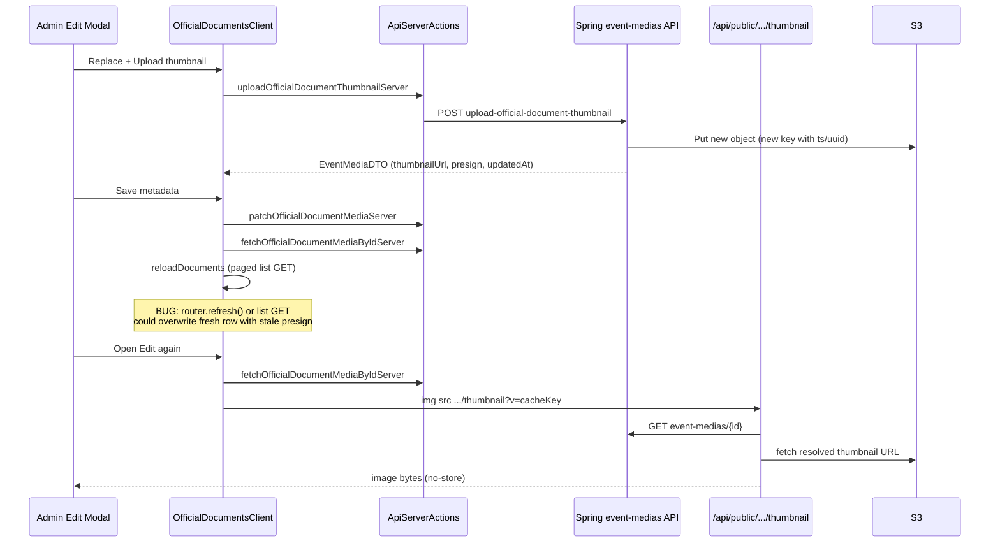

# Official Document Thumbnail — Stale Image After Replace

**Status:** Fixes implemented in Next.js (June 2026)  
**Symptom:** After uploading/replacing a card thumbnail on the admin page, the **old** image reappears when you Save, close the modal, and open Edit again — or on a **second** replace for another document. Backend logs show upload and GET return **200 OK** with updated `thumbnail_url` / `thumbnail_pre_signed_url`.

**Conclusion:** The backend persists the new file correctly. The bug is **frontend caching and state synchronization** between the admin UI, list API, RSC page props, and the public thumbnail proxy.

---

## Pages affected

| Page | Route | Component | What breaks |
|------|-------|-----------|-------------|
| **Admin — Official Documents** | `/admin/official-documents` | [`OfficialDocumentsClient.tsx`](../../../src/app/admin/official-documents/OfficialDocumentsClient.tsx) | Edit modal **Card thumbnail** preview shows the previous image after Save → Edit again |
| **Public — Downloads** | `/mosc-redesign/downloads` | [`DownloadsPageClient.tsx`](../../../src/app/mosc-redesign/(syro)/downloads/DownloadsPageClient.tsx) | Download cards can show an old preview until hard refresh (same underlying pipeline) |

Both pages render thumbnails through the **same shared pipeline** (not separate upload logic):

```
event_media row (Spring API)
    ↓
getOfficialDocumentCardThumbnailSrc()  ← src/lib/officialDocumentThumbnail.ts
    ↓
GET /api/public/official-documents/{id}/thumbnail?v={cacheKey}
    ↓
thumbnail proxy streams bytes from S3  ← src/pages/api/public/official-documents/[id]/thumbnail.ts
    ↓
  (admin modal or public card)
```

**Admin-only upload path:**

```
Edit modal → Replace thumbnail → Upload thumbnail
    ↓
uploadOfficialDocumentThumbnailServer()  ← ApiServerActions.ts (direct backend POST)
    ↓
POST /api/event-medias/{id}/upload-official-document-thumbnail
```

---

## Architecture (data flow)



---

## Root causes (verified)

### 1. Backend is not the problem

Spring logs consistently show:

- `POST .../upload-official-document-thumbnail` → **200**, DB updated  
- `GET .../event-medias/{id}` → **200**, DTO includes new thumbnail fields  
- `PATCH .../event-medias/{id}` (Save) → **200**, metadata only; thumbnails not cleared  

New S3 keys follow:  
`.../official_document/{slug}/{year}/thumbnails/{name}_{ts}_{uuid}.ext`  
(see [thumbnail/README.md](./README.md))

### 2. Stale `thumbnailPreSignedUrl` in list responses

After replace, the backend often updates `thumbnailUrl` to a **new** S3 path while the **paged list** (`GET /api/event-medias?...`) may still return a **valid** `thumbnailPreSignedUrl` that points at the **previous** object.

`getEventMediaDisplayThumbnailUrl()` originally preferred the presigned URL when it was not expired, so the proxy fetched **old bytes** even though `thumbnailUrl` was already new.

**Fix:** `isThumbnailPresignStale()` compares S3 object paths; if presign path ≠ stable path, ignore presign and use `thumbnailUrl`. Prefer non-presigned stable URL when possible so the proxy can append a cache-bust query param.

### 3. `router.refresh()` wiped client state (intermittent “worked once”)

In `OfficialDocumentsClient.tsx`, after Save/Upload:

1. Client merged fresh `EventMediaDTO` into `documents` state  
2. `reloadDocuments()` ran  
3. `router.refresh()` re-fetched the server page  
4. This `useEffect` ran and **replaced** the whole list with `initialDocuments` from the server:

```tsx
useEffect(() => {
  setDocuments(initialDocuments); // overwrote fresher client rows
}, [initialDocuments, ...]);
```

The server-rendered list often lagged behind the single-record GET, so the **second** upload looked broken while the **first** sometimes succeeded (timing-dependent).

**Fix:** Removed `router.refresh()` from thumbnail save/upload handlers; merge list updates instead of blind replace.

### 4. List reload overwrote fresh thumbnail metadata

`reloadDocuments()` did `setDocuments(result.content)` with no merge, clobbering thumbnail fields that had just been updated from `fetchOfficialDocumentMediaByIdServer`.

**Fix:** `mergeEventMediaListPreservingThumbnails()` keeps the newer thumbnail path / `updatedAt` / non-stale presign when merging list API results.

### 5. Weak cache-busting in the edit modal

Preview URL shape:  
`/api/public/official-documents/{id}/thumbnail?v={cacheKey}`

`cacheKey` included `updatedAt`, but the DB timestamp often has **second** precision. Two uploads in the same second produced the **same** `?v=` → browser served a cached proxy response with old image bytes.

**Fix:** `editThumbnailRevision` uses `Date.now()` on each open/upload (monotonic client revision appended as `|rev:...`).

### 6. Edit modal preview reverted immediately after upload (earlier bug)

A hidden proxy `` loaded the old S3 image and, on `onLoad`, cleared the local blob preview from the selected file.

**Fix:** `EditThumbnailPreview` shows **either** local blob URL **or** proxy URL; local preview stays pinned until the modal closes (`pinEditThumbnailLocalPreview` after upload).

### 7. Browser / CDN caching (public downloads page)

Earlier implementation **redirected** (302) to S3. Browsers cached the redirect and old object. Public cards on `/mosc-redesign/downloads` kept showing old art until hard refresh.

**Fix:** Thumbnail proxy **streams** bytes with `Cache-Control: no-store` and uses `?v=` cache keys built in [`DownloadsPageClient`](../../../src/app/mosc-redesign/(syro)/downloads/DownloadsPageClient.tsx) via `thumbnailCacheKey` from server actions.

### 8. Unrelated console noise

Messages like *“The resource was preloaded using link preload but not used…”* are Next.js/font/image **preload hints**. They do **not** cause the thumbnail bug and can be ignored for this issue.

---

## Files changed (proposed / implemented)

| File | Role | Change |
|------|------|--------|
| [`src/lib/officialDocumentThumbnail.ts`](../../../src/lib/officialDocumentThumbnail.ts) | URL resolution, cache keys, merge helpers | `isThumbnailPresignStale`, `resolveEventMediaThumbnailFields`, prefer stable `thumbnailUrl`, `mergeEventMediaListPreservingThumbnails` |
| [`src/app/admin/official-documents/OfficialDocumentsClient.tsx`](../../../src/app/admin/official-documents/OfficialDocumentsClient.tsx) | Admin UI + edit modal | Fresh fetch on open edit; `Date.now()` revision; merge on list sync; no `router.refresh()` on thumbnail flows; `EditThumbnailPreview` |
| [`src/app/admin/official-documents/ApiServerActions.ts`](../../../src/app/admin/official-documents/ApiServerActions.ts) | Server actions | Direct backend POST for upload (avoids proxy `Premature close`); `fetchOfficialDocumentMediaByIdServer` after mutations |
| [`src/pages/api/public/official-documents/[id]/thumbnail.ts`](../../../src/pages/api/public/official-documents/[id]/thumbnail.ts) | Public thumbnail proxy | Fresh GET metadata per request; stream S3 with `no-store`; normalized thumbnail fields |
| [`src/app/mosc-redesign/(syro)/downloads/DownloadsPageClient.tsx`](../../../src/app/mosc-redesign/(syro)/downloads/DownloadsPageClient.tsx) | Public cards | Uses same `getOfficialDocumentCardThumbnailSrc` + `thumbnailCacheKey` (consumer of proxy) |

---

## Proposed behavior (target state)

1. **Upload** writes a new S3 object and updates `thumbnail_url` (+ presign) in `event_media`.  
2. **Admin modal** shows the selected file immediately (blob URL) until close.  
3. **On Save or reopen Edit**, client loads `GET /api/event-medias/{id}` and builds proxy URL with a **unique** `?v=` (metadata + client revision).  
4. **List state** never drops newer thumbnail metadata when paged list or RSC props are stale.  
5. **Proxy** always resolves the correct S3 object (stale presign ignored) and streams with **no-store**.  
6. **Public downloads** cards update on next page load when `thumbnailCacheKey` / `updatedAt` / path changes.

---

## Verification checklist

### Admin (`/admin/official-documents`)

1. Hard refresh the page.  
2. Edit a document → **Replace thumbnail** → pick image → confirm instant preview.  
3. **Upload thumbnail** → preview stays on new image (no flash back to old).  
4. **Save** → close modal → **Edit** same row → preview must show **new** image.  
5. Repeat steps 2–4 on **another document** without full page reload (regression for “worked only once”).  
6. DevTools → Network: `GET /api/public/official-documents/{id}/thumbnail?v=...`  
   - Status **200** (not 302)  
   - `v=` includes `rev:` and changes after each upload  

### Public (`/mosc-redesign/downloads`)

1. Set document **Public** and note its category/year on downloads page.  
2. Replace thumbnail in admin; wait for save.  
3. Open or hard refresh downloads page → card preview shows new image.  

### Backend (sanity)

- `POST .../upload-official-document-thumbnail` → 200  
- `GET .../event-medias/{id}` → `thumbnailUrl` path contains new `{ts}_{uuid}` segment  

---

## If the issue persists

Capture for one failing `mediaId`:

| Check | Expected |
|-------|----------|
| `GET /api/event-medias/{id}` response | `thumbnailUrl` path matches newest S3 key |
| `thumbnailPreSignedUrl` path | Same object as `thumbnailUrl`, or expired / ignored by stale detection |
| Proxy request `?v=` | Different after each replace |
| Proxy response | 200 + `Cache-Control: no-store` |
| Proxy upstream | Not serving 403 on stable `thumbnailUrl` (S3 IAM / bucket policy) |

---

## Related docs

- [thumbnail/README.md](./README.md) — schema, API, display rules, recommended sizes  
- [../PRD_BACKEND.md](../PRD_BACKEND.md) — backend PRD for official documents  
